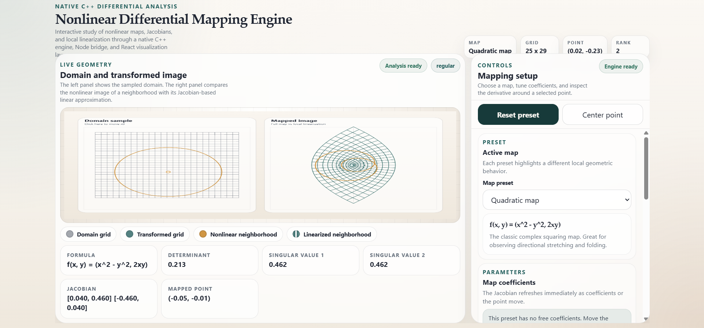

# Nonlinear Differential Mapping Engine

Interactive mathematical sandbox for exploring nonlinear maps, Jacobians, and local linearization through a native C++ engine, a lightweight Node.js bridge, and a React visualization layer.

The current implementation focuses on smooth maps of the form `f : R^2 -> R^2`, with real-time geometric sampling and pointwise differential analysis.



## What This Project Does

The app lets you choose a preset map, sample a square domain grid, and study the local behavior of the map around a selected point.

For the active configuration, the system can:

- transform a 2D grid under the selected map
- estimate the Jacobian numerically with central finite differences
- display determinant, rank, and singular values of the derivative
- compare the nonlinear image of a small neighborhood with its Jacobian-based linearization
- highlight regular versus singular behavior

## Included Map Presets

- `linear_shear`: `f(x, y) = (x + k y, y)`
- `anisotropic_scaling`: `f(x, y) = (lambda1 x, lambda2 y)`
- `quadratic_map`: `f(x, y) = (x^2 - y^2, 2xy)`
- `cubic_distortion`: `f(x, y) = (x + alpha x^3, y + beta y^3)`
- `singular_fold`: `f(x, y) = (s x^2, y + t x)`

## Architecture

The repository keeps a strict three-layer architecture:

```text
frontend_web/   -> React + Vite visualization layer
backend_node/   -> WebSocket bridge and engine process manager
engine_cpp/     -> Native nonlinear map evaluation and Jacobian engine
docs/           -> MkDocs project documentation
```

### Runtime Flow

```text
Browser --WebSocket(JSON)--> Node.js --stdin/stdout--> C++ Engine
Browser <--WebSocket(JSON)-- Node.js <--stdout-------- C++ Engine
```

- The engine owns the mathematical state and numerical routines.
- The backend keeps the native process alive and forwards validated messages.
- The frontend focuses on interaction and rendering.

## Mathematical Scope

The central object of study is a differentiable map

```math
f : \mathbb{R}^2 \to \mathbb{R}^2
```

written componentwise as

```math
f(x, y) = \bigl(f_1(x, y), f_2(x, y)\bigr).
```

At a selected point `x_0 = (x_0, y_0)`, the engine estimates the Jacobian matrix

```math
J_f(x_0) =
\begin{bmatrix}
\frac{\partial f_1}{\partial x}(x_0) & \frac{\partial f_1}{\partial y}(x_0) \\
\frac{\partial f_2}{\partial x}(x_0) & \frac{\partial f_2}{\partial y}(x_0)
\end{bmatrix}
```

and uses it as the first-order differential of the map:

```math
f(x_0 + h) = f(x_0) + J_f(x_0)h + o(\|h\|).
```

In practice, the frontend compares:

- the nonlinear image of a small neighborhood around `x_0`
- the linear approximation

```math
L_{x_0}(x) = f(x_0) + J_f(x_0)(x - x_0).
```

This makes several local phenomena visible:

- local stretching and compression through the singular values of `J_f(x_0)`
- orientation and area scaling through `\det J_f(x_0)`
- singular behavior when the rank of `J_f(x_0)` drops

For square maps `\mathbb{R}^2 \to \mathbb{R}^2`, singular points satisfy

```math
\det J_f(x_0) = 0,
```

which is exactly the regime where the map fails to be locally invertible in the first-order sense.

## Configuration Payload

The frontend sends configuration messages like:

```json
{
  "mapId": "quadratic_map",
  "parameterA": 0,
  "parameterB": 0,
  "gridColumns": 17,
  "gridRows": 17,
  "domainExtent": 2,
  "selectedX": 0.85,
  "selectedY": 0.45,
  "neighborhoodRadius": 0.3
}
```

## Getting Started

### 1. Build the C++ engine

```bash
cmake -S engine_cpp -B engine_cpp/build
cmake --build engine_cpp/build --config Release
```

### 2. Start the backend

```bash
cd backend_node
pnpm install
pnpm start
```

Default port: `3002`

### 3. Start the frontend

```bash
cd frontend_web
pnpm install
pnpm dev
```

The frontend connects to `ws://localhost:3002`.

## WebSocket API

### Client -> Server

- `configure`
- `reset`
- `request_state`

### Server -> Client

State payloads include:

- active map identifier and formula
- sampled domain points
- mapped grid points
- selected point and mapped point
- Jacobian matrix
- determinant
- rank
- singular values
- nonlinear and linearized neighborhood samples

## Design Principles

- Mathematics first: the project is built around real differential analysis concepts rather than generic visual effects.
- Native computation: map evaluation and Jacobian estimation live in C++.
- Thin transport layer: the backend forwards validated messages but does not do math.
- Visualization as explanation: the frontend turns local differential structure into geometry.
- Extensible presets: new maps can be added without changing the architecture.

## Future Improvements

- support for `R^3 -> R^3` presets
- custom preset definitions loaded from files
- symbolic derivatives for selected maps
- eigenvalue overlays for special cases
- inverse and implicit function theorem demos

## License

MIT
